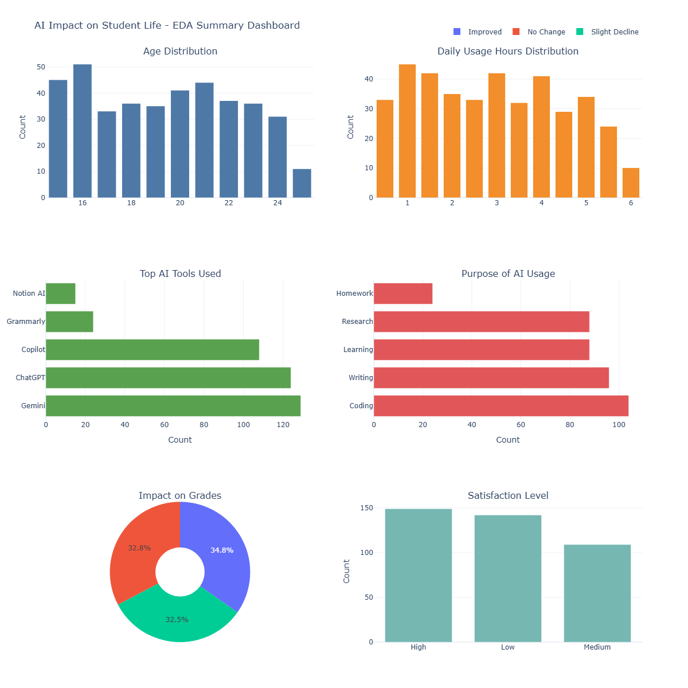

# AI Impact on Student Life — Exploratory Data Analysis

## 📌 Overview

This project explores how Artificial Intelligence tools are affecting student life — from daily usage habits to grade performance and satisfaction levels. The dataset was sourced from Kaggle (trending section) and analyzed using Python's core data science libraries.

## 🔍 What I Explored

- Age distribution of students in the dataset
- Daily AI usage hours
- Most popular AI tools among students
- Primary purposes of AI usage
- Impact of AI on academic grades
- Student satisfaction levels

## 📊 Key Findings

| Insight | Finding |
|---|---|
| Most used AI tool | Gemini & ChatGPT |
| Top use case | Coding, followed by Writing |
| Daily usage | Mostly 1–3 hours |
| Grade impact | ~35% Improved / ~33% No Change / ~32% Slight Decline |
| Satisfaction | High and Low are nearly equal, Medium slightly lower |

## 🛠️ Tools & Libraries

- **Python**
- **Pandas** — data loading & cleaning
- **Matplotlib** — basic visualizations
- **Seaborn** — styled statistical plots
- **Plotly** — interactive summary dashboard

## 📁 Project Structure
